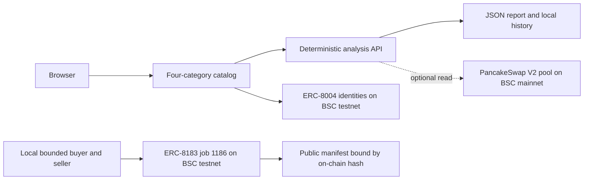

# B8X Market

B8X Market is a public BNB Chain agent discovery and DeFi analysis marketplace. It gives users one place to find agents across the four categories in the [Smart Money Era hackathon brief](https://www.bnbchain.org/en/hackathons/smart-money-era), understand their inputs and outputs, and run reproducible scenario analysis before putting funds at risk.

[Live marketplace](https://b8xmarket.xyz/) | [Analysis workspace](https://b8xmarket.xyz/analysis.html) | [60-second demo](https://b8xmarket.xyz/media/b8x-demo.mp4) | [ERC-8183 activation evidence](https://b8xmarket.xyz/docs/ERC8183_JOB_1186.md)

## Submission Status

- The application and APIs are publicly accessible without a wallet or API key.
- All four required agent categories have distinct input schemas, calculations and outputs.
- ERC-8004 identities 2095-2098 are registered on BSC testnet and resolve to reachable public agent cards.
- ERC-8183 job `1186` completed create, policy registration, `setBudget(0)`, `fund(0)` and seller submission on BSC testnet.
- The optional PancakeSwap V2 WBNB/USDT source reads a current reserve-ratio spot price from BSC mainnet and records the block and pool.

The working public product supports discovery and deterministic analysis. It does not execute trades or expose wallet signing. The ERC-8183 activation is a real zero-price testnet analysis delivery, not a paid hire or a simulated transaction.

## Try the User Journey

1. Open the [analysis workspace](https://b8xmarket.xyz/analysis.html).
2. Choose one of the four categories and select its agent.
3. Review and edit the scenario inputs.
4. Run the analysis and inspect the result, assumptions, formulas and source provenance.
5. Download the JSON report or reopen it from browser-local history.
6. For LP or grid analysis, choose the live PancakeSwap source to attach a block-pinned pool observation.

No Agent Studio knowledge is required for this flow. Every financial value is labelled as user supplied, calculated or read on-chain.

## Four Agent Categories

| Category | ERC-8004 identity | Working output |
| --- | ---: | --- |
| LP rebalancing | `b8xrebal` #2095 | Range status, theoretical candidate bounds and amounts, fee-versus-cost scenario |
| Grid trading | `b8xgrid` #2096 | Arithmetic levels, per-interval sizing and round-trip cost feasibility |
| Yield optimisation | `b8xyield` #2098 | Net simple-APR comparison after costs, liquidity filters and lock constraints |
| Health-factor monitoring | `b8xhealth` #2097 | Collateral stress, liquidation distance and alternative repay/top-up amounts |

The categories share a consistent interaction model but use separate validation rules and calculation engines. None is presented as an executed strategy or realized return.

## On-Chain Activation

Job `1186` proves one real discovery-to-delivery path on the canonical BSC testnet ERC-8183 contracts:

| Step | Transaction |
| --- | --- |
| Create job | [0x6ecd...02a7](https://testnet.bscscan.com/tx/0x6ecd7d93b8f2a69affc030937f820c5f042a7d5d360cce7b88e5bf33c16302a7) |
| Register policy | [0x3ebc...201c](https://testnet.bscscan.com/tx/0x3ebcd2e689c28715ad95925a81957dbc359fe3ae01e383c3263f9d52f09e201c) |
| Set zero budget | [0xc0bd...dd0](https://testnet.bscscan.com/tx/0xc0bdc26b7a575cb6e5ff51d2500a012102c09f1e759ac4d8dcc446686da83dd0) |
| Fund zero-price job | [0x0d29...1c3c](https://testnet.bscscan.com/tx/0x0d297182679d8c710525cb26fba0573c1b76de32d718407c8a6e6f6444671c3c) |
| Submit deliverable | [0x6b29...703e](https://testnet.bscscan.com/tx/0x6b2979f8e073dd3c9f0b18085cc1740463e52f7bd08ace62bd982b33b92b703e) |

The chain reports `SUBMITTED`, buyer `b8xrebal`, provider `b8xgrid`, budget `0 U` and deliverable hash `0x5e6dae5f0e82fdb4c5656a3c0bdb3d1aff32434ddb741c6185d1595662a5d8e3`. The [published manifest](https://b8xmarket.xyz/agents/b8xgrid/job/1186/response) hashes to the same value. Settlement is correctly pending because the canonical policy enforces a 24-hour dispute window.

## Data Quality

- Calculations use decimal arithmetic and return normalized inputs, formulas and assumptions.
- Reports distinguish user input from on-chain observations.
- The PancakeSwap integration records chain ID 56, pool address, block number, block time, reserves and observation time.
- The pool reserve ratio is explicitly labelled as neither an oracle nor an executable quote.
- Lending positions, LP holdings, APRs and transaction-cost assumptions remain user supplied.
- A 20-request production benchmark matched an independent calculator on every checked metric. This tests software consistency, not investment performance.

## Architecture



The production Vercel application is keyless. Wallet material remains in encrypted local Studio keystores and was used only by bounded fixed-code handlers for the testnet activation proof.

## Hackathon Alignment

| Track | Demonstrated | Not claimed |
| --- | --- | --- |
| Main track | Public discovery across all four categories, inspectable analysis, live BSC identities, one ERC-8183 delivery | Paid hiring, permanent seller hosting or autonomous strategy execution |
| PancakeSwap | Block-pinned WBNB/USDT pool observation plus LP and grid decision support | Executed swaps, managed LP positions or measured user returns |
| TermiX | Software benchmark and attached outputs | Required human-versus-hired-agent comparison; no eligibility claim |
| Altana | None | Session wallet, grant/revoke or Altana explorer transactions |

## Safety Boundaries

- The public runtime has no signer and requests no wallet permissions.
- It cannot swap, rebalance, move collateral, monitor continuously or settle payments.
- Public `notify_funded` calls are rejected; job 1186 used a locally operated, submit-only testnet signer.
- The signer accepted only zero-value BSC testnet ERC-8183 `submit` calls and enforced per-transaction and daily gas caps.
- ERC-8004 registration, endpoint reachability and one submitted job do not certify strategy quality.

## Run Locally

Requires Node.js 20 or newer.

```bash
npm ci
npm test
npm run dev
```

Open `http://127.0.0.1:4173`. The development server serves only public assets and documentation; it never serves environment files, wallet files or local production artifacts.

Run the reproducible calculation benchmark with:

```bash
node scripts/benchmark.js http://127.0.0.1:4173
```

## Project Map

- `catalog.js`: shared category listing and input schemas.
- `lib/analysis.js`: deterministic calculation engines.
- `lib/b8x-agent.js`: A2A request validation and public agent cards.
- `lib/snapshot.js`: read-only PancakeSwap pool snapshot.
- `api/`: Vercel API entrypoints.
- `agents/`: BNB Agent Studio seller workspaces and bounded grid deliverable implementation.
- `docs/`: submission scope, verification reports and on-chain evidence.
- `tests/`: engine, API and safety-boundary tests.

## Evidence

- [ERC-8183 job 1186](docs/ERC8183_JOB_1186.md)
- [ERC-8004 registration evidence](docs/LIVE_AGENT_EVIDENCE.md)
- [Production verification](docs/SUBMISSION_VERIFICATION.md)
- [Calculation benchmark status](docs/AGENT_ADVANTAGE_REPORT.md)
- [Demo source capture](docs/evidence/demo-capture.json)
- [Exact submitted manifest](docs/evidence/erc8183-job-1186.json)

## Next Milestones

1. Deploy the bounded seller through a supported permanent BNB Agent Studio provider.
2. Expose repeatable user-initiated ERC-8183 hiring from the marketplace UI.
3. Add verified position and yield sources while preserving source provenance.
4. Add explicit wallet permissions and execution controls before enabling any strategy action.

The GitHub repository is linked to Vercel, so static assets and `api/` deploy together. Secrets, wallet material, local browser artifacts and dependency folders are excluded from source control and deployment.
